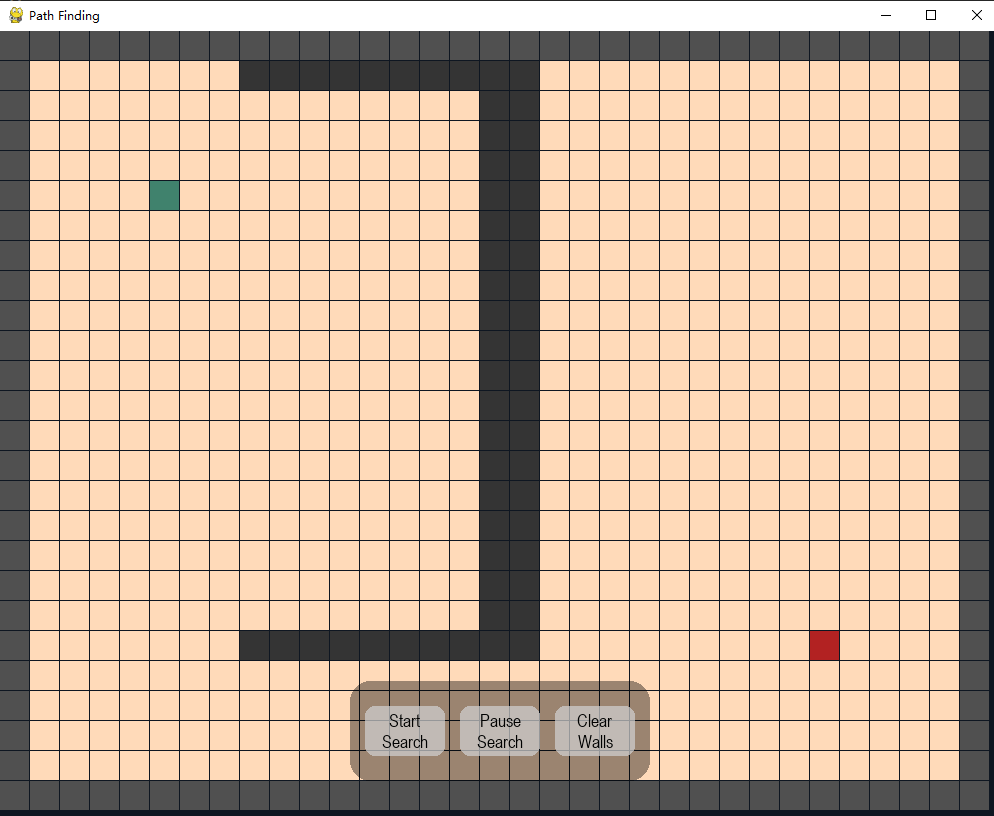

# A Star Algorithm

本文档用于记录A star算法代码开发

在Map文件夹中建立了网格地图，因此A star算法将基于网格地图进行寻径


## 要解决的问题

根据网格地图中起点与终点的位置、地图边界与障碍物，寻找起点与终点间不发生碰撞的最优路径



## 算法输入

1. 起点与终点的位置参数
2. 障碍物的位置
3. 地图边界信息


## 算法输出

1. 根据启发函数的选择不同，输出相应的路径，记录路径的长度
2. 将拓展过的节点显示在窗口
3. 查找路径花费的时间，拓展的操作次数
4. 动态显示拓展的过程


## 算法流程

```
OPEN = priority queue containing START
CLOSED = empty set
while lowest rank in OPEN is not the GOAL:
  current = remove lowest rank item from OPEN
  add current to CLOSED
  for neighbors of current:
    cost = g(current) + movementcost(current, neighbor)
    if neighbor in OPEN and cost less than g(neighbor):
      remove neighbor from OPEN, because new path is better
    if neighbor in CLOSED and cost less than g(neighbor): ⁽²⁾
      remove neighbor from CLOSED
    if neighbor not in OPEN and neighbor not in CLOSED:
      set g(neighbor) to cost
      add neighbor to OPEN
      set priority queue rank to g(neighbor) + h(neighbor)
      set neighbor's parent to current

reconstruct reverse path from goal to start
by following parent pointers
```


### 初始化open_set， closed_set

The OPEN set contains those nodes that are candidates for examining.

Initially, the OPEN set contains only one element: the starting position.

The CLOSED set contains those nodes that have already been examined.

 Initially, the CLOSED set is empty. 

open_set用于存储当前所在节点周围可探索的节点，如果是4-directions，则当前节点的open_list有四个元素

closed_set用于存储探索过的节点


### 计算当前节点到起点的实际距离


