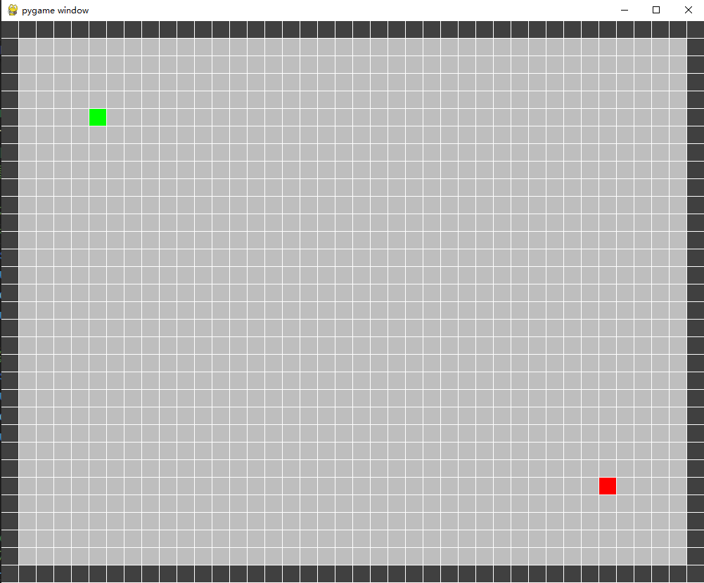
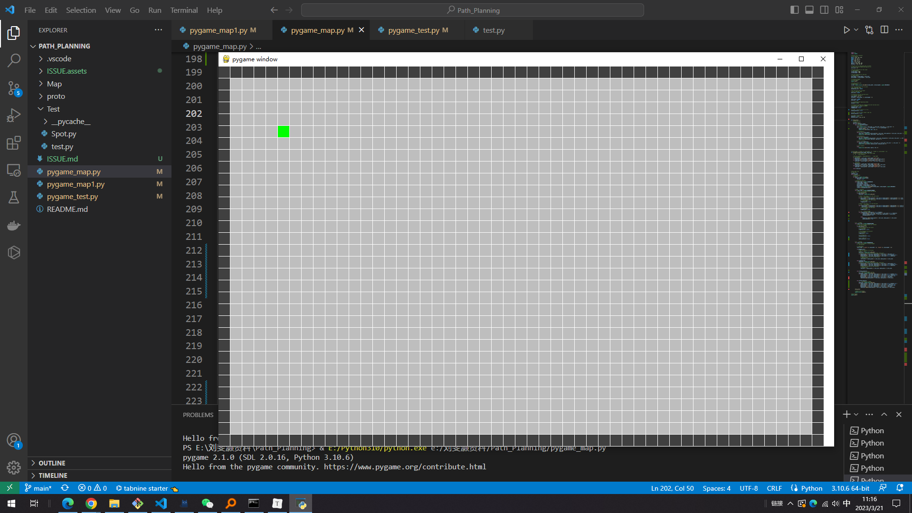
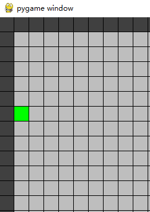
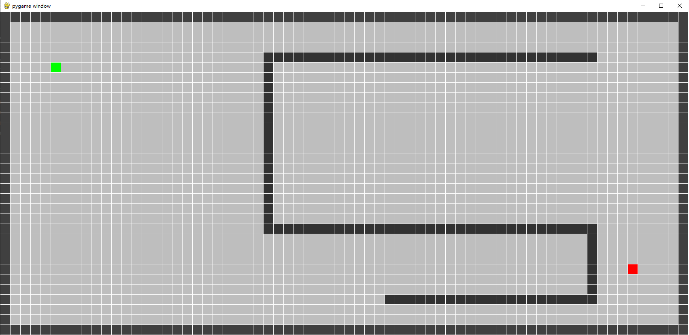
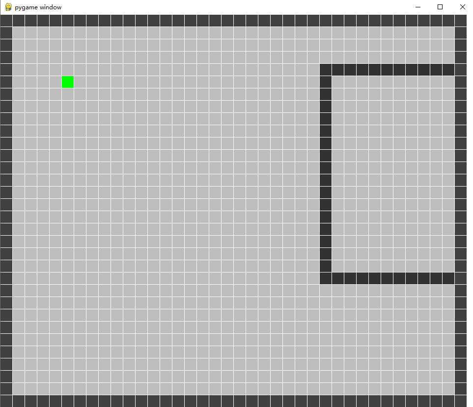
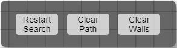

# 开发过程问题记录

## 地图交互界面

### 1、边界可行性设置

在设置网格地图的过程中，将网格地图的边界设置为了深色，即不可行区域

因此在设置起点和终点时，**起点、终点以及障碍物的选取不能为网格的边界点，更不能超出网格地图的边界**

网格的边界为下图的黑色方块，绿色为起点，红色为终点



有两种思路：

1. 将所有的边界点用一个集合记录下来，只有鼠标的点不在这个边界点集合内就可以

   ```python
   boundary.clear()
       for i in range(grid_width):
           for j in range(grid_height):
               # 绘制边框
               if i == 0 or j == 0 or i == grid_width - 1 or j == grid_height - 1:
                   boundary.add((i, j))
   # 判断方法               
   ((mouse_pos[0] // cell_size, mouse_pos[1] // cell_size)) not in boundary              
   ```

   通过实际测试，当界面为初始界面时可行，但界面缩放之后，鼠标会移动到边界外，此时起点或终点也会出去，但是不会与边界点重合，只会超出边界，此时终点已经跑到如图中右侧的空白区域。

   

2. 根据网格的索引设置有效区域，当鼠标的点超出这个区域时，则将最终点设置为有效区域内最靠近边界的点

   设置了一个有效范围，如果没有超过有限范围则为当前点，如果超过了则将其设置为边界上旁最接近的可行的点。

   ```python
   # valid_range = {'width':(1, grid_width - 2), 'height':(1, grid_height - 2)}
   
   def validate_verify(valid_range, mouse_pos):
       # Check if the mouse is within the valid range
       # 检查鼠标是否在有效范围内
   
       # 如果不在有效范围, 则将有效范围内设为鼠标能到达的点
       # 检查横向范围
       if mouse_pos[0] // cell_size < valid_range['width'][0]:
           mouse_pos = (valid_range['width'][0] * cell_size, mouse_pos[1])
       elif mouse_pos[0] // cell_size > valid_range['width'][1]:
           mouse_pos = (valid_range['width'][1] * cell_size, mouse_pos[1])
   
       # 检查纵向范围
       if mouse_pos[1] // cell_size < valid_range['height'][0]:
           mouse_pos = (mouse_pos[0], valid_range['height'][0] * cell_size)
       elif mouse_pos[1] // cell_size > valid_range['height'][1]:
           mouse_pos = (mouse_pos[0], valid_range['height'][1] * cell_size)
       
       return mouse_pos
   ```

   例如，横向超出了左边界，但纵向没有，此时横坐标为左边界旁的第一个可行点，而纵向不变

   


### 2、障碍物选择

通过鼠标左键点击非边界区域、非起点和终点的单元格，可以将其设置为障碍物，用黑色表示

采用鼠标拖动的方式，可以实现批量选择单元格作为障碍物

当鼠标点击或滑动在已经设为障碍物的单元格时，将会使这个障碍物重新变为自由区域

#### 解决方法

设置两个布尔变量，分别用于滑动选择障碍物drawing_obstacle和删除障碍物delete_obstacle，初始化为Flase

当鼠标点击的单元格为自由区域时，将drawing_obstacle=True，对除了边界、起点、终点的单元格进行选择

当鼠标点击的单元格为障碍物区域时，将delete_obstacle=True，将选中的障碍物区域设为空白区域

```python
# 初始化鼠标滑动选中单元格作为障碍物
drawing_obstacle = False

# 初始化鼠标滑动选中单元格实现障碍物的删除
delete_obstacle = False

# 初始化障碍物单元格数据
obstacles = set()
# Main game loop
# 主游戏循环
running = True
while running:
    # Handle events
    # 处理事件
    for event in pygame.event.get():
        if event.type == pygame.QUIT:
            running = False
            
		# 当鼠标抬起时
        elif event.type == pygame.MOUSEBUTTONUP:
            # Check if left mouse button was released
            # 检查是否释放了左键
            if event.button == 1:   
                # 停止选择障碍物
                drawing_obstacle = False

                # 停止删除障碍物
                delete_obstacle = False
          
        # 处理鼠标按下事件
        elif event.type == pygame.MOUSEBUTTONDOWN:
            # Check if left mouse button was pressed
            # 检查是否按下了左键
            if event.button == 1:
                mouse_pos = pygame.mouse.get_pos()
            # 检查鼠标是否在自由区域
            elif (mouse_pos[0], mouse_pos[1]) not in boundary:
                if ((mouse_pos[0] // cell_size, mouse_pos[1] // cell_size)) not in obstacles:
                    # 如果当前单元格不在障碍物集合中，则将其加入集合中
                    obstacles.add((mouse_pos[0] // cell_size, mouse_pos[1] // cell_size))
                    drawing_obstacle = True

                else:
                    # 如果当前单元格为障碍物，则将其从障碍物集合删除
                    obstacles.remove((mouse_pos[0] // cell_size, mouse_pos[1] // cell_size))
                    delete_obstacle = True
                    
		# 当鼠标移动时
        elif event.type == pygame.MOUSEMOTION:
            # Check if the mouse is being dragged
            # 检查是否在拖拽
            elif drawing_obstacle:
                # 鼠标滑动选择空白区域作为障碍物
                mouse_pos = pygame.mouse.get_pos()
                if ((mouse_pos[0] // cell_size, mouse_pos[1] // cell_size)) not in boundary and \
                   ((mouse_pos[0] // cell_size, mouse_pos[1] // cell_size)) not in obstacles and \
                   (mouse_pos[0] // cell_size, mouse_pos[1] // cell_size) != start_point and\
                   (mouse_pos[0] // cell_size, mouse_pos[1] // cell_size) != end_point:
                    obstacles.add((mouse_pos[0] // cell_size, mouse_pos[1] // cell_size))
                    
            elif delete_obstacle:
                # 鼠标滑动将已有障碍物取消
                mouse_pos = pygame.mouse.get_pos()
                if ((mouse_pos[0] // cell_size, mouse_pos[1] // cell_size)) not in boundary and \
                   ((mouse_pos[0] // cell_size, mouse_pos[1] // cell_size)) in obstacles and \
                   (mouse_pos[0] // cell_size, mouse_pos[1] // cell_size) != start_point and \
                   (mouse_pos[0] // cell_size, mouse_pos[1] // cell_size) != end_point:
                    obstacles.remove((mouse_pos[0] // cell_size, mouse_pos[1] // cell_size))
```

功能实现如下

<video src="C:/Users/40162/Videos/Captures/pygame window 2023-03-21 12-56-24.mp4"></video>


### 3、窗口缩放变化问题

当窗口从初始窗口扩大或缩小时，原有的点在窗口不可显示

放大后的窗口如图所示，此时将终点拖拽到右下角，并设置了障碍物区域



但是缩小窗口后，终点以及部分障碍物均不可见



#### 解决方法

1、固定窗口的大小，不允许用户进行窗口的缩放

2、可以考虑当窗口缩放后，起点与终点均会重新进行初始化，将起点和终点根据窗口大小进行适当的调整

##### 起点与终点初始化的方式：

​	1.每次调整窗口，都初始化起点与终点在同一个位置，即

```
start_point = (5, 5)
end_point = (grid_width - 6, grid_height - 6)
```

问题：初始化在同一个位置时，会出现这个位置是障碍物，此时相当于起点与终点在障碍物的位置重合

​	2.每次调整窗口，判断起点与终点在不在当前窗口内，是不是与障碍物的位置重合了

​		如果仍在当前窗口，且没有与障碍物重合，则起点或终点的位置不变化

​		如果不在当前窗口，或者与障碍物出现了重合，则：

​				1）选择一个不与障碍物重合的位置，对起点或者终点进行初始化。

​				2）删除所有障碍物

​		1）方案更合适

```python
def update_start_end_point(self):
        """
        当窗口缩放时, 按照固定更新模式会导致起点或终点更新与障碍物位置发生重合
        因此需要根据地图环境以及障碍物信息, 对起点与终点网格位置进行更新
        更新策略：
            1.窗口变化时判断起点or终点是否在界面内
            2.若不在界面内，则给出默认的初始化点
            3.如果这个点与障碍物的点重合, 则查找自由区域点进行更新
        """
        # print("re-initializing start and end point")
        if not self.verify_point(self.start_point):
            # 如果超出区域, 则重置起点
            self.start_point = (5, 5)
        if not self.verify_point(self.end_point):
            # 如果超出区域, 则重置终点
            self.end_point = (self.grid_width - 6, self.grid_height - 6)
        
        width_range  = list(range(self.valid_range['width'][0],  self.valid_range['width'][1]))
        height_range = list(range(self.valid_range['height'][0], self.valid_range['height'][1]))
        self.start_point = self.search_point(self.start_point, width_range, height_range)
        self.end_point   = self.search_point(self.end_point,   list(reversed(width_range)), 
                                                               list(reversed(height_range)))
```


##### 障碍物处理方式

但是对于障碍物的解决方式还未想好，有三种方案：

​	1.清空所有障碍物；每次改变窗口都删除所有障碍物单元格

​	2.假设在一个s1=1000*800的窗口设置了障碍物，当窗口改为s2=500\*400后，只对当前窗口边界内的障碍物进		行显示，即超出边界的障碍物进行删除，就算窗口重新恢复到s1，也只有当前s2下的障碍物

​		目前认为最优的障碍物处理策略为方法2

​		可以改进，记录窗口变化前的障碍物位置，当窗口恢复多少，相应障碍物就恢复多少

​		通过设置两个障碍物集合，集合1用于记录所有障碍物，集合2根据窗口进行筛选

​	3.对障碍物的大小进行等比例的缩放，当窗口缩小时，障碍物所占空间也等比例缩小，但是对于不均匀分布的障		碍物不好用，暂且不使用该方案


### 4、设置带有按钮的浮动窗口

设置一个小窗口，根据需求设定窗口的大小，在小窗口上横向均匀布置三个按钮，通过点击按钮可以执行指定的命令与模块，例如下图：




